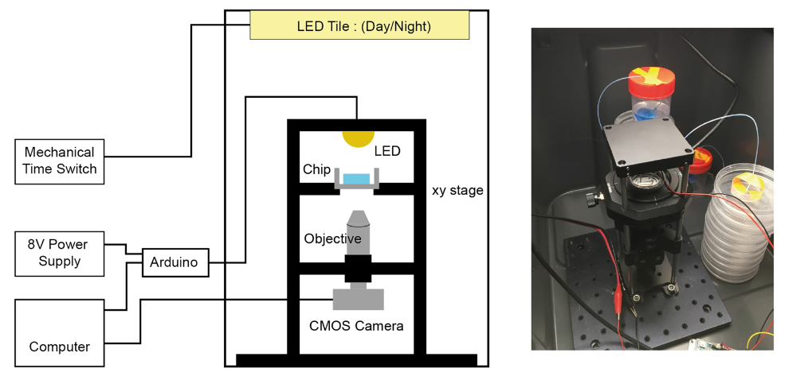
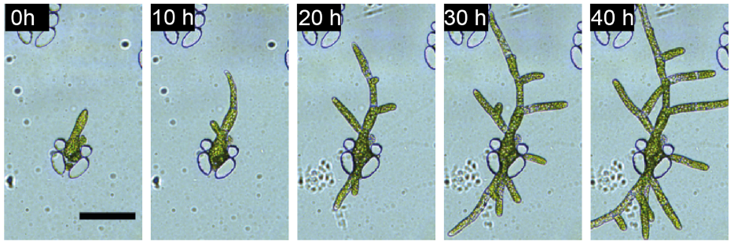
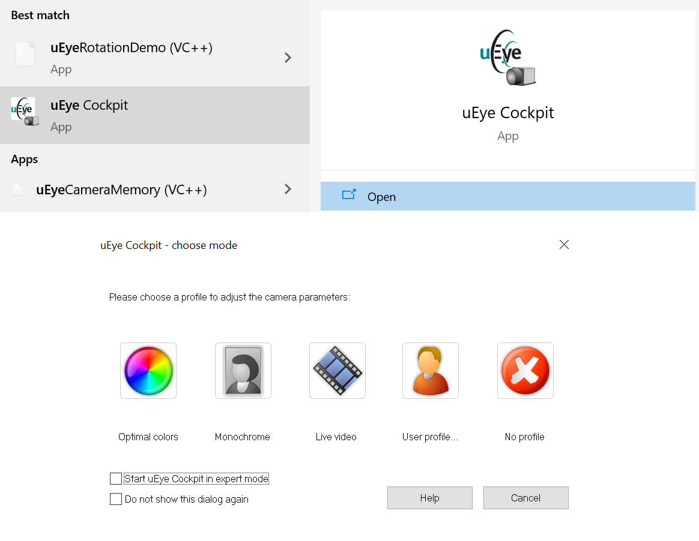
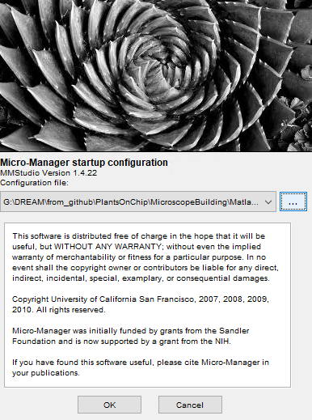
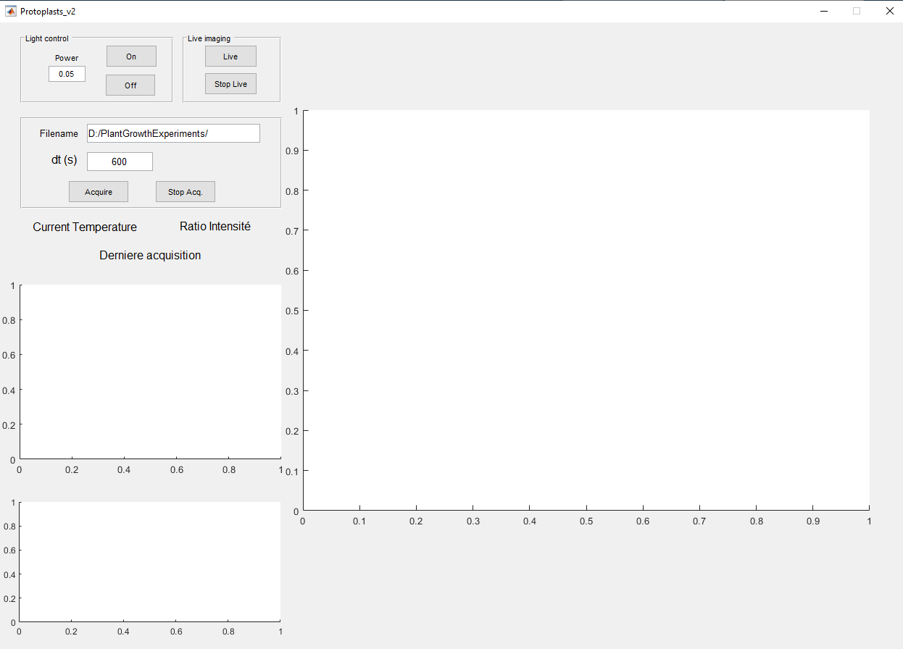

# PlantsOnChip
The set-up allows to take timelapse or live video of a microsystem. The whole set-up fits in an incubator, made from a commercial black plastic storage box, the night/day illumination is created by a light-emitting diode (LED) tile controlled by a mechanical time switch.  
 The microscope itself is made from common optical mounting elements, a CMOS (Complementary Metal Oxide Semiconductor) color camera for imaging, a xy manual translation stage and an Arduino-controlled LED for the intermittent illumina-tion of the sample all along the experiment. The LED element is built by the manufacturer with a collecting lens of large numerical aperture, ca. 60°, that makes illumination homogeneous in the field of view without the need to use a conventional condenser. To immobilize the glass-bottom Petri dish containing the microchip, we designed a 3D-printed adaptor for the xy-stage. A temperature sensor is also connected to the Arduino board for the continuous recording of this parameter during the exper-iment. Temperature varies according to the photoperiod in the 21.5 ± 1.5 °C range. 




To ease the experiments, we developed a graphical user interface (Matlab) for the control of the LED intensity, the image timelapse parameters, and the recording of the pictures taken with the camera. Currently, the microscope is built with a 10× plan-corrected objective with a low numerical aperture and without any tube lens. Our setup can work continuously for several weeks for a given sample without noticing any defocusing, nor any detrimental effect of the presence of the LED element on the plant growth and development. The following figure shows a time-lapse recording of the development of chloronema for 40 h in photoperiodic conditions, where tip growth and side-branching are clearly visible despite the simplicity of the setup.



# Installation

## Copying the code

To use the instrument properly you need to fetch the code from this page. If you are familiar with git use the command:

```git clone https://github.com/FattaccioliLab/PlantsOnChip.git```  
from the command line, at the desired location.

Otherwise you can download the repository by clicking the green button "code" and selecting "Download zip" and extract the folder where it suits you best on your computer.

## Set-up the camera
First you need to download the camera driver. Go to [IDS website](https://fr.ids-imaging.com/download-details/AB00484.html), create an account and then you will be able to download the driver (available for Windows and Linux).  
To check the camera is workinig, launch the app Ueye Cockpit and select a color mode. 



In the Matlab application developped, the camera is controlled via Micro-Manager which is an app developped to control easily a microscope camera independantly of the brand and the supplier's software. Download the version adapted to your OS here: [µmanager](https://micro-manager.org/wiki/Download_Micro-Manager_Latest_Release).  

Once you installed Micro-Manager, launch it and a startup-configuration window will appear.   

 

The config-file you want to test is in the repository you copied: PlantsOnChip/MicroscopeBuilding/MatlabCode/MicroscopeControl/Microscope/Protoplasts2.cfg  

Now the camera is set-up and tested.

The Matlab code commands the camera via Micro-Manager, therefore you have to link Matlab and Micro-Manager. Before following the instructions you should know that you can list all files in a folder and subfolder with a given extension via the command line, or using python. 
From Windows command line, cd to desire folder and type: 
```
dir /S/b *.jar
```   
For python:   
```
import os
for root, dirs, files in os.walk("/Micro-Manager-1.4"):
     for file in files:
         if file.endswith(".jar"):
             print("C:/" + os.path.join(root, file))
```  
 Now you can follow the instructions [here](https://micro-manager.org/wiki/Matlab_Configuration).

## Preparing Matlab environment
The Matlab code relies on several Add-Ons you should install:
- GUIDE to App Designer Migration Tool for MATLAB
- Image Processing Toolbox
- Instrument Control Toolbox
- Matlab Support Package for Arduino Hardware
- Symbolic Math Toolbox
- Statistics and Machine Learning Toolbox
- Simulink

## Making the correct wire connections
TODO
## Testing Arduino connection
The Matlab code commands the Arduino board to control the LED on top of the set-up which allows to have a good quality image with its high intensity. To test the Arduino connection type in the :

```
%Initialize Arduino
comport=instrfindall;
delete(comport);
board=arduino();
handles.board=board;
handles.light_status=0;
writePWMDutyCycle(board,'D2',0);
```
The last line commands the level of illumination of the LED by changing the duty ratio (last argument) of the input signal which oscillates at XXMHz. The light intensity is proportional to the duty ratio. At 0, the LED should be off. At 1 the LED shines so bright that you shouldn't look at it. To test this, you can copy the last line, paste it in the console and try several values for the last argument.

## Launching the code
Open the directory PlantsOnChip/MicroscopeBuilding/MatlabCode/MicroscopeControl/Microscope/ in Matlab and type 
```Protoplasts_v2()``` in the console. This should launch an app:  




You can set the level of the LED, the live mode or time-lapse mode. In time-lapse (Acquire) one image will be captured every dt second and savec in the directory under PNG format.